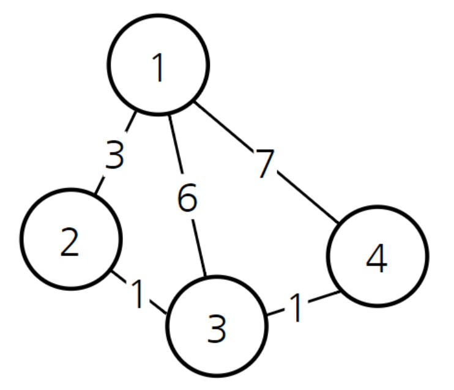

# 다익스트라(Dijkstra) 알고리즘 - 최단경로


## 🛣️ 다익스트라 알고리즘

- 그래프에서 **최단 경로**를 찾는 알고리즘이다.
  - 대표적인 **최단 경로 탐색** 알고리즘
    - 인공위성, GPS 등 현실세계에서 많이 사용되는 알고리즘

- 하나의 정점(시작점)에서 다른 모든 정점으로 가는 최단 경로를 알 수 있다. 
- 그리디 알고리즘, DP(다이나믹 프로그래밍)이 녹아있음
  - DP인 이유: 하나의 최단 거리를 구하려면 그 이전까지 구했던 최단 거리 정보를 사용하기 때문.

- *단, 음의 간선은 포함할 수 X*



### 작동과정

1. 출발 노드를 설정한다.

2. 출발 노드를 기준으로 연결된 노드에 거리를 저장한다.

   **모든 노드를 방문할 때까지 3 ~ 4번 반복**

3. 방문하지 않은 노드 중에서 최단 거리가 가장 짧은 노드를 선택한다.

4. 해당 노드와 연결된 노드들에 대해 최단 거리를 갱신한다.


참고: [안경잡이개발자](https://m.blog.naver.com/ndb796/221234424646)


## 🏑 기본 다익스트라 알고리즘

- 시간 복잡도: O(V^2)    (V: 노드 개수)
  - 이유: **3번 과정**에서 매 단계마다 노드의 개수 만큼 **순차탐색**을 수행하기 때문
    - `get_smallest_node()` 함수의 `for i in range(1, v+1): ` 부분!
  - v(노드의 개수)가 많은 경우엔 시간 복잡도가 너무 커진다.
  - 그래서 개선된 다익스트라 알고리즘이 필요함.

- 동빈나님이 기본 다익스트라랑, 개선된 다익스트라를 자다가도 벌떡 일어나서 바로 구현할 수 있을 정도로 반복 숙지하랬음 ㅇ0ㅇ

#### 코드

```python
def get_smallest_node():  # 방문하지 않은 노드 중 가장 비용이 적은 노드를 찾는 함수
    min_value = float('inf')
    node = 0
    for i in range(1, v+1):
        if not visited[i] and distances[i] < min_value:
            min_value = distances[i]
            node = i
    return node


v, e = map(int, input().split())  # v 정점 개수, e 간선 개수
k = int(input())  # k 시작 정점
adj_list = [[] for _ in range(v+1)]  # 인접리스트  # 0번 인덱스는 빈칸
for _ in range(e):
    v1, v2, w = map(int, input().split())
    adj_list[v1].append((v2, w))  # (정점번호, 가중치)

visited = [0]*(v+1)
distances = [float('inf')]*(v+1)  # 최단거리를 저장할 배열

# 시작점 k 방문
distances[k] = 0
visited[k] = 1
for next in adj_list[k]:
    distances[next[0]] = next[1]

# 남은 v-1개의 노드를 모두 방문
for _ in range(v-1):
    now = get_smallest_node()
    visited[now] = 1
    for next in adj_list[now]:
        cost = distances[now] + next[1]
        distances[next[0]] = min(cost, distances[next[0]])
```


## 🪁 개선된 다익스트라 알고리즘 - 우선순위 큐 활용

[참고 블로그](https://techblog-history-younghunjo1.tistory.com/248?category=1014800)

- 시간 복잡도: O(ElogV)    (E: 간선 개수, V: 노드 개수)

#### 코드

```python
import sys
import heapq
input = sys.stdin.readline

v, e = map(int, input().split())  # v 노드 개수, e 간선 개수
k = int(input())  # k 시작 노드
adj_list = [[] for _ in range(v+1)]  # 인접리스트  # 0번 인덱스는 빈칸
for _ in range(e):
    v1, v2, w = map(int, input().split())
    adj_list[v1].append((v2, w))  # (노드번호, 가중치)

priority_q = []  # 우선순위 큐  # (거리, 노드번호)
distances = [float('inf')]*(v+1)  # 최단거리를 저장할 배열

# 시작점 k 방문
distances[k] = 0
heapq.heappush(priority_q, (0, k))

# 남은 v-1개의 노드를 모두 방문
while priority_q:
    d, now = heapq.heappop(priority_q)
    if d > distances[now]:  # 큐에 저장돼있는 거리가 이미 갱신된 거리보다 클 경우 무시
        continue
    for next in adj_list[now]:  # next: 연결된 노드
        cost = distances[now] + next[1]
        if cost < distances[next[0]]:
            distances[next[0]] = cost
            heapq.heappush(priority_q, (cost, next[0]))  # 거리가 갱신될 경우에만 큐에 넣는다.

for i in range(1, v+1):
    if distances[i] == float('inf'):
        print('INF')
    else:
        print(distances[i])
```

