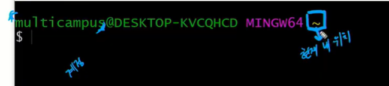
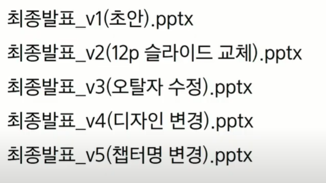

# git basic

## H2. 내용

 Git이란? 버전관리

**git이란?**

**what** (분산) 버전 관리 시스템 distributed version ~

코드의 히스토리

why| 버전관리: 과거의 버전으로 돌아갈 필요가 있을 것 같아서. -> 용량의 문제

깃의 기능 -> 변경사항만 남기자

> git이 있다면,

차이가 무엇이고 수정 이유를 log로 남길 수 있다.


CLI (Command Line Interface)

GUI (Graphical User Interface)

|      |            CLI             |                          GUI                           |
| ---- | :------------------------: | :----------------------------------------------------: |
| 장점 |        자유도 높음         | 1. 쓰기 쉬움<br />2. 안전장치 있음 ex) 삭제하면 휴지통 |
| 단점 | 불편하고 배워야 쓸 수 있음 |                   잠금이 있는 점(?)                    |


단축키

| 단축키   | 기능                  |
| -------- | --------------------- |
| ctrl + l | 페이지 위로 쭉 올리기 |
| ctrl + c | 취소                  |
|          |                       |


```
$ git remote add origin <URL>
$ git init

# 촬영에 비유
$ git add .  						 #1.촬영 준비
$ git commit -m '<COMMOT MESSAGE>'	 #2.촬영 with메시지
$ git push origin master			 #3.업로드

# 상태 점검
$ git log
$ git status
```

add . 촬영준비 / commit  -m git 촬영 / push 업로드

```
$ mkdir <dirname> 	:폴더 생성       directiry=>폴더
$ cd <dirname>  : 지정한 폴더로 이동
$ cd .. : 폴더 나오기(상위 폴더로 감)

$ rm <dirname> : 영구 삭제(shift + delete)
$ rm -r <dirname> : 폴더는 r넣어줘야 함
$ rm -rf <dirname> :

$ ls : 폴더 내 항목들 보기
$ ls -a : 
```



노란색 물결~  => ㅊㅇ .현재 내 위치


start . 탐색기 열기

touch 파일 생성


TIL 참고

https://github.com/cheese10yun/TIL


## Git

git: version control system

버전 관리 시스템



Linus Torvalds -> Git, Linux 개발


git bash는 키자마자 홈폴더임.

거기서 start . 하면 홈폴더 탐색기 염.

### 로컬 저장소 Local repo

### 초기화 

Directory(폴더) ===`$ git init`===> Repository(저장소)

`$ git init`

※ 주의git

1. 홈폴더 init하면 안됨
2. repo안에 repo 만들면 안됨

Repo 안에는 3가지 공간이 있음 (추상적)

1. 작업공간 | 분장실

2. 스테이지 | 촬영장

3. ★ 저장소 commits | 촬영.     사진을 찍는다 = 커밋을 한다

반복

우리는 코디네이터- 코드 수정

#### 커밋 남기기

모든 커밋에는 작성자의 서명이 필요. -처음 한번만 하면 됨

내 user name: Yen_tree

$ git add

+ 파일명 : 해당 파일만 올리기
+ . : 현재 폴더 올리기

$ git commit

#### 모니터링

$ git status : 상태 확인. 바뀌는게 없으니 엄청 자주 쳐도 됨

$ git log: 저장소의 커밋들 조회. 사진첩 들여다보기

커밋 고유 ID

$ git log --oneline : log를 좀더 간단하게


code . : vscode로 열기(로 미리 설정해놈)


### Remote repo 원격 저장소

불 나면 내 소스코드들 사라짐

-> 리포를 클라우드에 백업

- 대표 서비스: 깃랩, 깃헙, 비트버켓

local repo(내 컴)를 remote repo(lap.ssafy)에 백업

모든 remote repo는 url이 있다.

**연결**

`$ git remote add <name> <url>`  remote repo를 추가할거야

#### 업로드 & 다운로드

`$ git push <name> <branch>`

`$ git pull <name> <branch>`


### PULL만 받는 repo 만드는 방법

**클론**(남에거 받아오는것)도 한번만 하면 됨

1. 폴더 생성
2. `$ git init`
3. `$ git clone <url>`   **https주소로 입력해야함
4. `$ git pull origin master`


## 프로젝트

프로젝트 리모트리포 명: pjt01로 통일

관통프로젝트 제출: 매주 금요일 18시까지★

이번 프로젝트만 자정까지 제출(push)

리드미도 작성해서 올려야함.

- 프로젝트 repo에 `README.md` 파일을 생성하고 진행 과정, 학습한 내용, 느낀점 등을 작성합니다.
- 중요하다고 생각되는 내용만. 정리해서.


남은 시간 프로젝트 하면 됨. 웹엑스 캠 꺼도 됨.

- 프로젝트만큼은 질문보다는 스스로 찾아보기! 해결책 스스로 찾기
- 단 서로 도와서 하는건 괜찮음.
- 오늘은 혼자서!!


